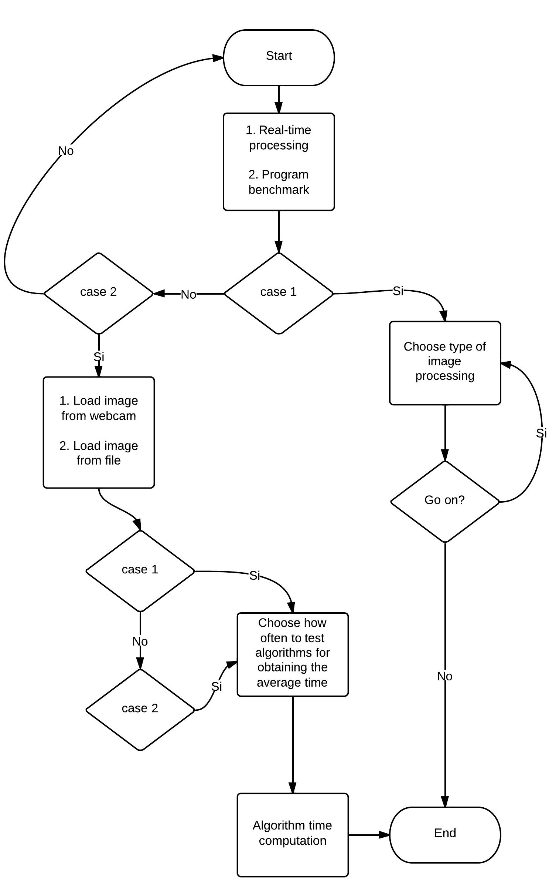
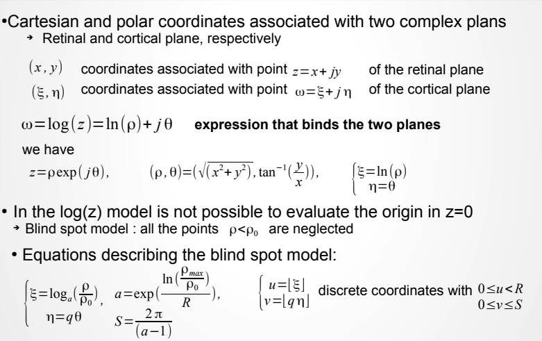
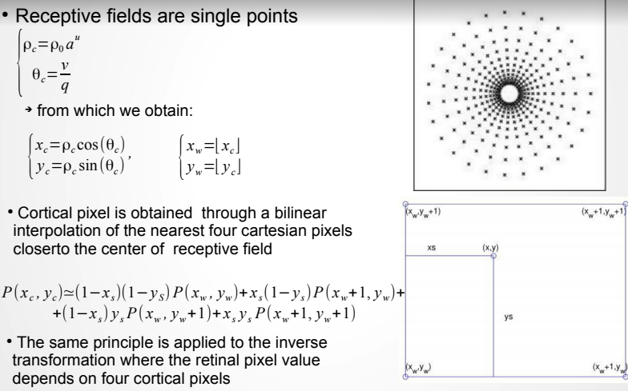
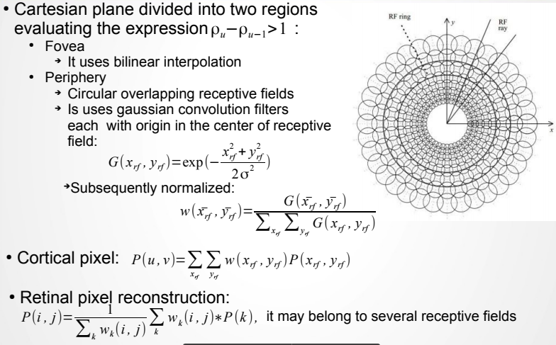

##Dependencies
OpenCV(tested 3.3.1), CUDA(tested on cuda 9.2)

## Compilation
### Using Makefile
make

### Using CMake
mkdir build && cd build  
make   

# Development of a CUDA C++/OpenCV image processing application by  implementing space variant algorithms on GPU

Implementation, in CUDA C++ language, of algorithms for webcam signal acquisition and subsequent image processing using space-variant transformations of the visual signal, which allow to vary the image resolution depending on distance from the area of interest, which leads to a reduction in size and consequently a lower computational burden. In order to achieve more significant accelerations in the calculation step, the algorithms, as regards the parallelizable code segments will be executed on GPU (Graphics Process Units), to take advantage of data-parallelism, threads, and instructions provided by this hardware

## Program flow chart

  

## Retino-cortical transformation  

  

## Bilinear interpolation  

## Wilson model  

2013 Slide presentation:  https://goo.gl/A3jhGG

Demo on youtube: https://www.youtube.com/watch?v=m43EsVtOzXA
